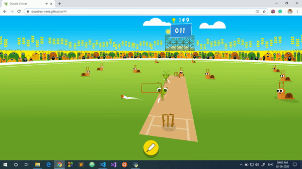

# Google's Doodle Cricket game automation
**CricketAutomation.py** can be used to automate the Doodle Cricket game. The game can be played online by going to the [Doodle Criket](https://doodlecricket.github.io/#/ "Doodle Criket's Homepage") homepage. The **CricketAutomation.py** captures the screenshot using **pyautogui** python library, and using openCV finds if the ball is in the hitting area. If it is in the hitting area, it issues command to signal the pressing of "enter" key.

Before running for the first time, you might need to tweak some coordinates acccording to your screen resolution. To get the coordinates, you can use **GetCoordinatesAndColor.py** file. It takes image file name as input and gives coordinates of a particular pixel when mouse is double clickedon that image. To automate, first execute **CricketAutomation.py** locally and then go to the website [Doodle Criket](https://doodlecricket.github.io/#/ "Doodle Criket's Homepage"). 

Credits to [Harsh Gupta](https://github.com/Harsh1347) for his T Rex Game automation.
